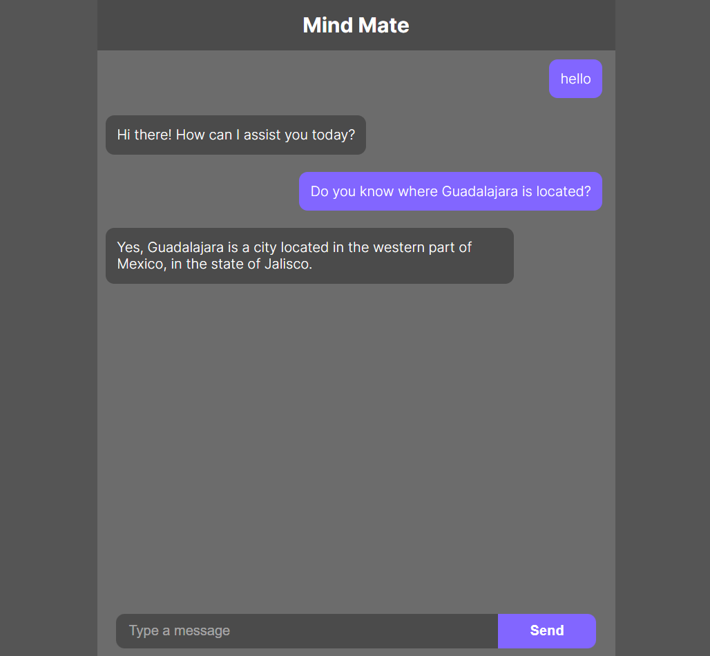
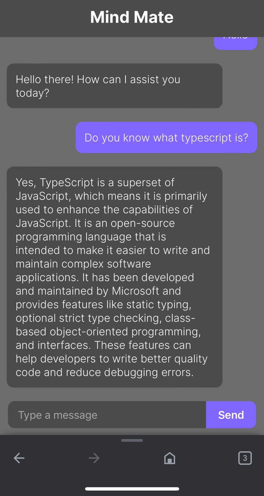

# This is a Next.js Project with OpenAI API

This is a botchat application that uses the OpenAI API gpt-3.5-turbo.

### Desktop preview



### Mobile preview



## Getting Started

First, run the development server:

```bash
npm run dev
# or
yarn dev
# or
pnpm dev
```

Open [http://localhost:3000](http://localhost:3000) with your browser to see the result.
